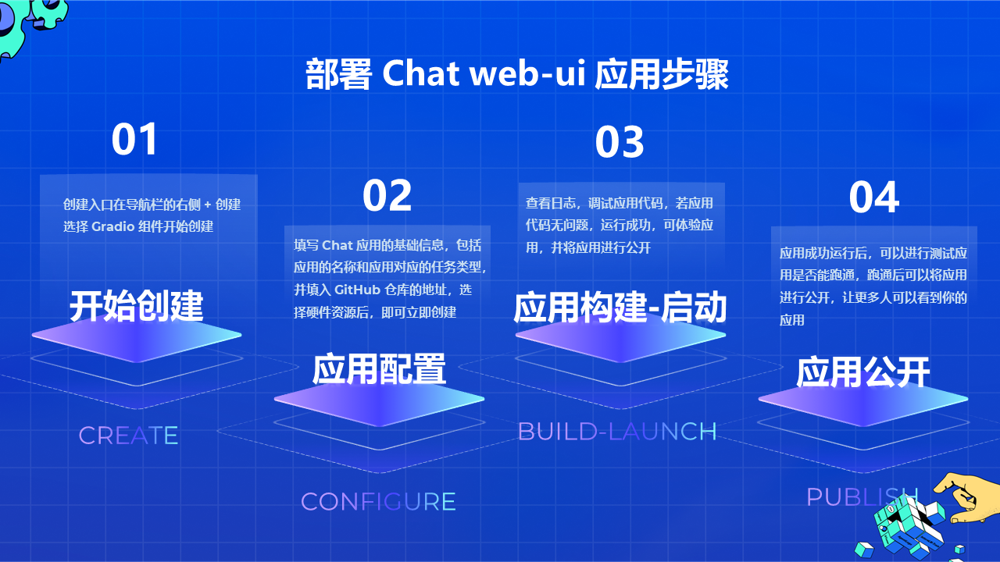
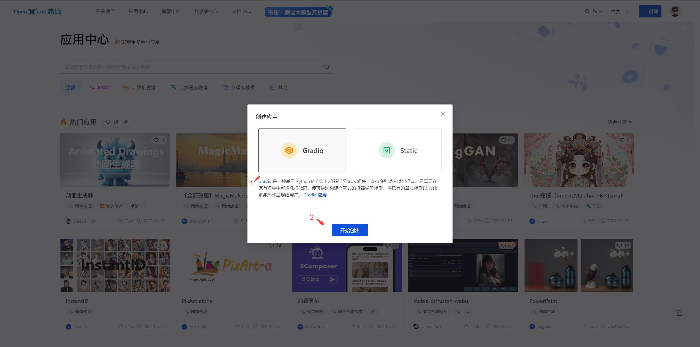
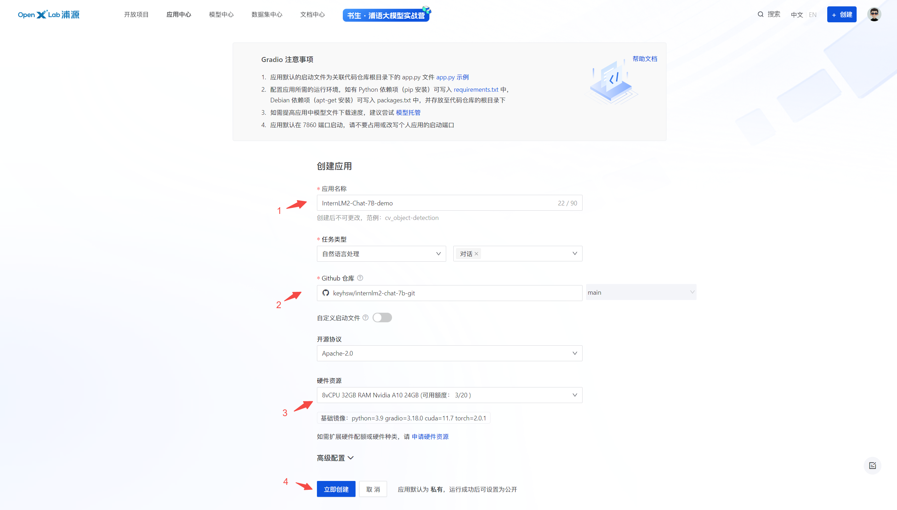
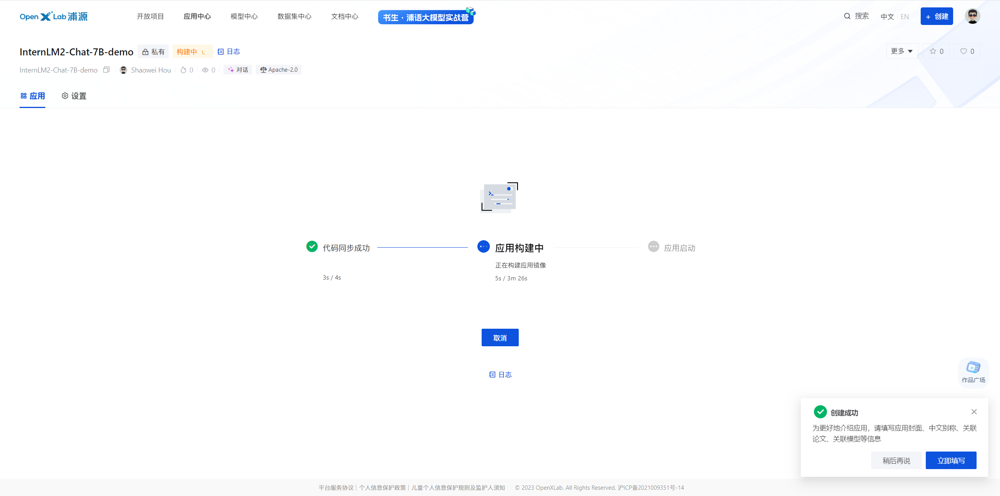
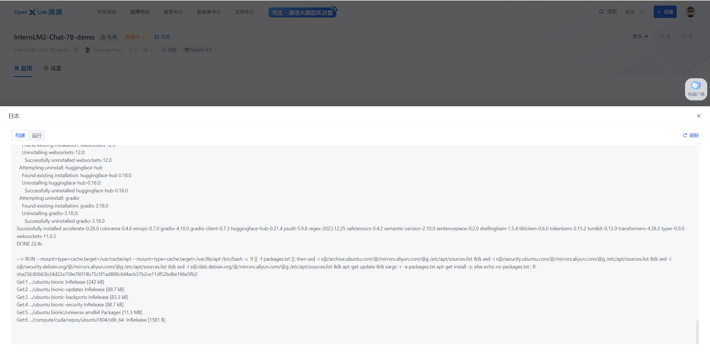
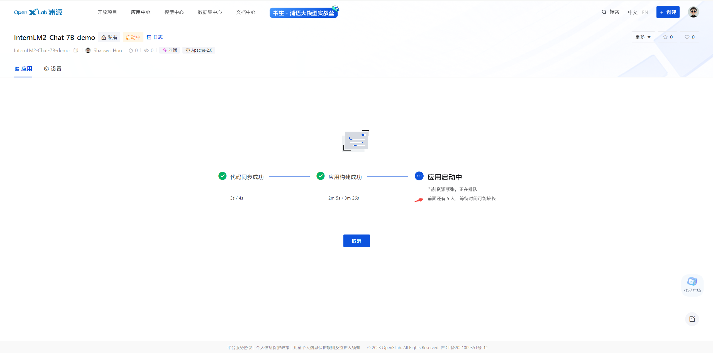
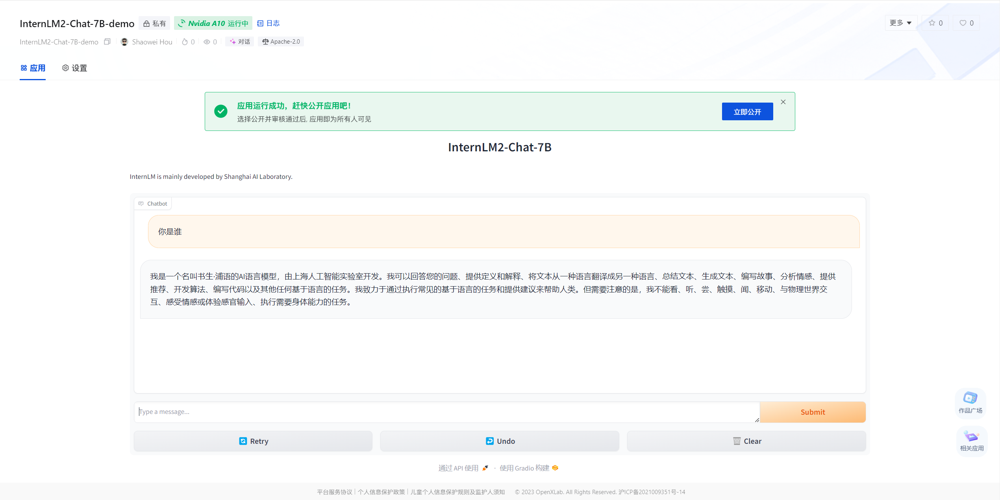

# SeaSageAI-chat-20b-git
&nbsp; 
## 编写代码

本项目编写 LLM-chat 的 web-ui 代码，主要包括项目结构初始化、应用环境配置和 gradio 应用代码的编写


### 项目结构

```shell
├─GitHub_Repo_Name
│  ├─app.py                 # Gradio 应用默认启动文件为app.py，应用代码相关的文件包含模型推理，应用的前端配置代码
│  ├─requirements.txt       # 安装运行所需要的 Python 库依赖（pip 安装）
│  ├─packages.txt           # 安装运行所需要的 Debian 依赖项（ apt-get 安装）
|  ├─README.md              # 编写应用相关的介绍性的文档
│  └─... 
```


&nbsp; 
### 应用环境配置

**依赖管理**：配置应用所需的运行环境,如有 Python 依赖项（ pip 安装）可写入 requirements.txt 中，Debian 依赖项（ apt-get 安装）可写入 packages.txt 中，并存放至代码仓库的根目录下。

requirement.txt 配置 python相关的依赖包，例如 gradio、torch、transformers 等

```text
gradio==4.10.0
transformers
sentencepiece
einops
accelerate
tiktoken
```

packages.txt 配置下载模型权重的工具包 git 和 git-lfs

```text
git
git-lfs
```

> **其他环境安装**：若您需要安装除了 Python 以外的包，如需要通过 mim 安装 mmcv，您可先在 requirement.txt 中填写 mim，然后在 `app.py` 中写入以下代码，即可完成相关包的安装：
>
> ```python
> import os
> os.system("mim install mmcv-full")
> ```


&nbsp; 
### 编写 gradio 应用代码

app.py 文件通过 transformers 框架进行模型实例化并通过 gradio 组件搭建 chat 聊天界面。

```python
import gradio as gr
import os
import torch
from transformers import AutoModelForCausalLM, AutoTokenizer, AutoModel

# download internlm2 to the base_path directory using git tool
base_path = './internlm2-chat-7b'
os.system(f'git clone https://code.openxlab.org.cn/OpenLMLab/internlm2-chat-7b.git {base_path}')
os.system(f'cd {base_path} && git lfs pull')

tokenizer = AutoTokenizer.from_pretrained(base_path,trust_remote_code=True)
model = AutoModelForCausalLM.from_pretrained(base_path,trust_remote_code=True, torch_dtype=torch.float16).cuda()

def chat(message,history):
    for response,history in model.stream_chat(tokenizer,message,history,max_length=2048,top_p=0.7,temperature=1):
        yield response

gr.ChatInterface(chat,
                 title="InternLM2-Chat-7B",
                description="""
InternLM is mainly developed by Shanghai AI Laboratory.  
                 """,
                 ).queue(1).launch()
```
&nbsp; 
 **应用代码注意事项** ：在 `app.py` 文件中，如需下载模型和了解文件存放路径

 1. **工作目录**：OpenXLab 应用代码默认存储的位置为 **`/home/xlab-app-center`**，如需指定存储路径，可用相对路径“./”表示，本示例采用相对路径方式
 2. **模型下载**：若需要在app.py中快速导入模型，可前往 模型中心上传模型权重后，通过平台提供的 git 方式进行下载，详情可参考 [应用如何导入模型中心的模型](https://openxlab.org.cn/docs/apps/%E5%BA%94%E7%94%A8%E5%88%9B%E5%BB%BA%E6%B5%81%E7%A8%8B.html#%E5%BA%94%E7%94%A8%E5%A6%82%E4%BD%95%E5%AF%BC%E5%85%A5%E6%A8%A1%E5%9E%8B%E4%B8%AD%E5%BF%83%E7%9A%84%E6%A8%A1%E5%9E%8B)，模型上传的详细步骤可查看 [模型上传详细流程](https://openxlab.org.cn/docs/models/%E4%B8%8A%E4%BC%A0%E6%A8%A1%E5%9E%8B.html)

 ```python
 import os
 # download internlm2 to the base_path directory using git tool
 base_path = './internlm2-chat-7b'
 os.system(f'git clone https://code.openxlab.org.cn/OpenLMLab/internlm2-chat-7b.git {base_path}')
 os.system(f'cd {base_path} && git lfs pull')
 ```


&nbsp; 
## 部署应用

在OpenXLab浦源平台中，部署写好的 chat web-ui 的应用，具体步骤如下。



### 创建入口

创建入口在导航栏的右侧 `+ 创建` ，如下如所示：


选择Gradio组件，开始创建




&nbsp; 
### 应用配置

填写 Chat 应用的基础信息，包括应用的名称和应用对应的任务类型，并填入 GitHub 仓库的地址，选择硬件资源后，即可立即创建啦~




&nbsp; 
**应用配置注意事项**

1. **GitHub 授权**：若未进行 GitHub 授权,请先前往授权
2. **自定义启动文件**：若您有需要自定义启动的文件,可以通过配置选择启动文件的路径
3. **资源申请**：若当前您的资源quota不能满足您的应用需求,也可以填写硬件资源申请表单进行 [申请获取](https://openxlab.org.cn/apps/apply-hardware)
 * 如需部署 InternLM2-7b 模型建议申请 8vCPU 32GB Nvidia A10 24GB 规格资源
 * 如需部署 InternLM2-20b 模型建议申请 12vCPU 48GB Nvidia A100 40GB 规格资源
4. **环境变量配置**：若您有不方便在代码中暴露的变量信息,可通过高级配置中的环境变量进行配置 


&nbsp; 
### 应用构建和启动

查看日志，调试应用代码，若应用代码无问题，运行成功，可体验应用，并将应用进行公开



> 构建应用过程中，可以尽量去完善应用的信息，包括应用封面、中文别称、关联论文和关联模型等信息，有利于后续的平台的推荐~


&nbsp; 
构建过程中，可查看应用的构建日志，及时查看应用的构建进度和启动情况





> 由于平台资源有限，可能会因为没有资源启动而进入排队中，请耐心等候


&nbsp; 
### 应用公开

应用成功运行后，可以进行测试应用是否能跑通，跑通后可以将应用进行公开，让更多人可以看到您的应用哦~



internlm2-7B-chat-demo应用体验地址：https://openxlab.org.cn/apps/detail/houshaowei/SeaSageAI-chat-20b


&nbsp; 
<br/>
**Reference**
* OpenXLab 平台介绍 ：https://openxlab.org.cn/docs/intro.html
* OpenXLab Gradio 应用教程：https://openxlab.org.cn/docs/apps/Gradio%E5%BA%94%E7%94%A8.html
* OpenXLab 上传模型教程：https://openxlab.org.cn/docs/models/%E4%B8%8A%E4%BC%A0%E6%A8%A1%E5%9E%8B.html
